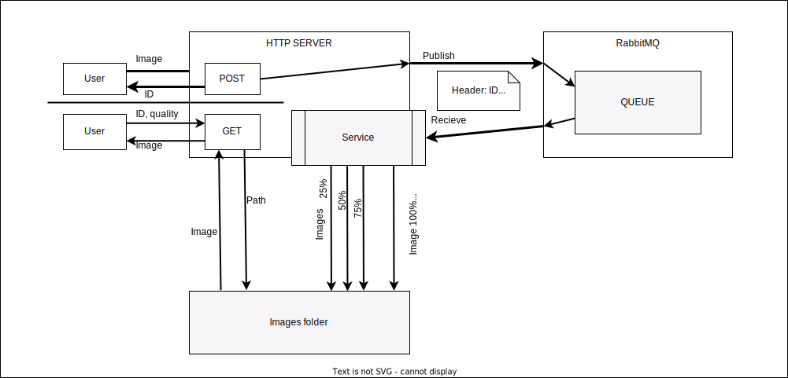
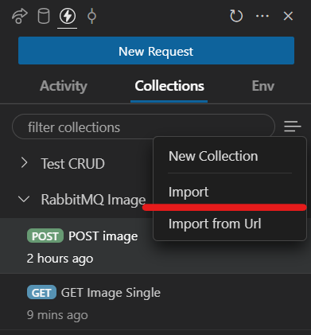

# Test task for GO

## 👋  Summary

The goal is to create an HTTP API for uploading, optimizing, and serving images.

1. The API should expose an endpoint for uploading an image. After uploading, the image should be sent for optimization via a queue (e.g. RabbitMQ) to prevent excessive system load in case of many parallel image uploads and increase the system durability.
2. Uploaded images should be taken from the queue one by one and optimized using the `github.com/h2non/bimg` go package (or `github.com/nfnt/resize` package). For each original image, three smaller-size image variants should be generated and saved, with 75%, 50%, and 25% quality.
3. The API should expose an endpoint for downloading an image by ID. The endpoint should allow specifying the image optimization level using query parameters (e.g. `?quality=100/75/50/25`).

## 🤔  Evaluation criteria

1. **Functionality.** The developed solution should function as described in the "Summary" section. However, if you think that you can create a solution better than described in the "Summary" section, you are welcome to do so.
2. **Code simplicity**. The architecture should be simple and easy to understand, the code should be well-formatted and consistent. Usage of code formatters (like gofmt) and linters (like golangci-lint) is encouraged.

___

## 💥 Realization

Workflow:



App structure:

```note
/internal
    /app                    // Application that has all required components

    /delivery               // Package that include infrastructure for communicating by HTTP protocols
        /http                   // http
            /handler                // user defined handler
            /rest                   // REST API methods for handler
            /server                 // http server
        /rabbitmq               // amqp
            /client                 // RabbitMQ client

    /domain                 // Domain business logic
        /dto                    // Data Transfer Object
        /repositories           // Interfaces for services (use-cases)

    /infrastructure         // Actual implementation of components
        /file                   // Local file storage (using standard pkg os / filepath / io/ioutil)
        /worker                 // Background job / service that proceed the image from MessageBroker
            /compressor             // as a part of background job

    /services               // Services that App uses
        /image                  // Image service
        /publisher              // Part of MessageBroker (only Send to...) for HTTP API
```

## ✅ Usage

```note
make rabbit       // Up the RabbitMQ instance from docker
make rabbit-stop  // Stop and delete the container

go run cmd/main.go
```

### OUTPUT

You can see the [examples.log](./examples.log) file for actual output of the application

> Pay attention that in the log I've put the ID, URL and etc. data that are not for production!
>
> It's a test task, so I just skip this part of hiding the USER information (but what someone can steal? ImageID? XD)
>
> REMOVE the ID, URL and other information or CROP it

### How can I improve the application

1. WRITE UNIT/INTEGRATION/E2E TESTS (but it takes TOO MUCH time)
2. Add database for register the errors in background job, if user wants to know which problems his/her image has
3. Redirect errors from the Goroutines
4. Remove HARDCODE and add ENV setup or flags of app
5. USE the specific exchanger/channel/queue of RabbitMQ
6. Use relative path
7. Use caching (if need)
8. . . .

### 🟡 Notes

I don't use the `github.com/h2non/bimg` package due to its dependency for Linux.

I've written this application on Windows platform. I could use the WSL2 for example, but it to long for open it.

Hope it won't be a problem :)

## 💯 Testing

I've using the [Thunder client](https://marketplace.visualstudio.com/items?itemName=rangav.vscode-thunder-client) (`rangav.vscode-thunder-client`) extension from VS Code to proceed HTTP requests

### ❗ NO AUTOMATION TESTS

The HTTP methods collections that have been used placed there: [collection.json](./thunder-collection_RabbitMQ%20Image.json)

> PAY attention: in POST method you need replace the path to the image file in the body

```json
"body": {
        "type": "formdata",
        "raw": "",
        "form": [],
        "files": [
            {
                "name": "image",
                "value": "<PATH TO IMAGE>"
            }
        ]
    },
```

> For GET HTTP method:

```json
"url": "localhost:8080/img/<UUID OF IMAGE>"
```

> Use the json file for import:


