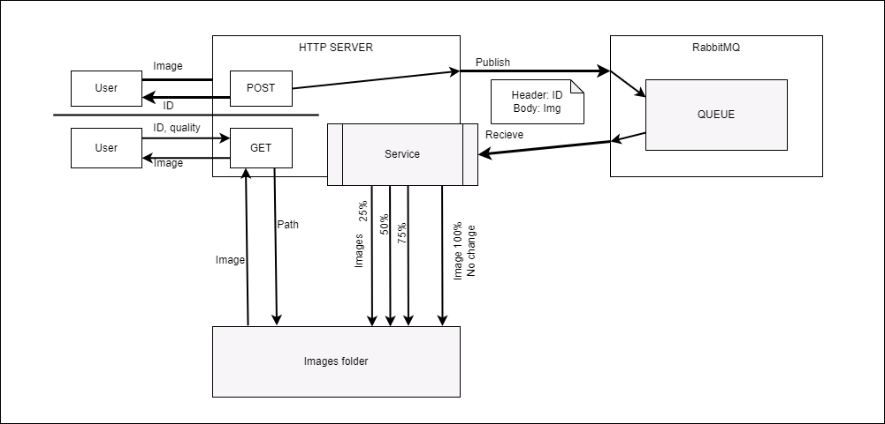

# Test task for GO

## 👋  Summary

The goal is to create an HTTP API for uploading, optimizing, and serving images.

1. The API should expose an endpoint for uploading an image. After uploading, the image should be sent for optimization via a queue (e.g. RabbitMQ) to prevent excessive system load in case of many parallel image uploads and increase the system durability.
2. Uploaded images should be taken from the queue one by one and optimized using the `github.com/h2non/bimg` go package (or `github.com/nfnt/resize` package). For each original image, three smaller-size image variants should be generated and saved, with 75%, 50%, and 25% quality.
3. The API should expose an endpoint for downloading an image by ID. The endpoint should allow specifying the image optimization level using query parameters (e.g. `?quality=100/75/50/25`).

## 🤔  Evaluation criteria

1. **Functionality.** The developed solution should function as described in the "Summary" section. However, if you think that you can create a solution better than described in the "Summary" section, you are welcome to do so.
2. **Code simplicity**. The architecture should be simple and easy to understand, the code should be well-formatted and consistent. Usage of code formatters (like gofmt) and linters (like golangci-lint) is encouraged.

___

## 💥 Realization

Workflow:



App structure:

```note
/internal
    /domain
        /models
        /repositories
    /infrastructure
        /file
            /repository
        /gorm
    /delivery
        /http
            /rest
                /api
        /rabbitmq
            /client
    /services
        /image
            /compress
            /storage
```

Usage:

```note
docker run -d --hostname my-rabbit --name some-rabbit -p 15672:15672 -p 5672:5672 rabbitmq:3-management

docker run --name some-postgres -e POSTGRES_PASSWORD=mySecretPassword -d postgres

/cmd
    /publish - send one msg
    /receive - read all msg
    /gorm - gorm example
    /resizer - service cmd
```

## 💯 Testing

I've using the [Thunder client](https://marketplace.visualstudio.com/items?itemName=rangav.vscode-thunder-client) (`rangav.vscode-thunder-client`) extension from VS Code to proceed HTTP requests

The HTTP methods collections that have been used placed there: [collection.json](./thunder-collection_RabbitMQ%20Image.json)

> PAY attention: in POST method you need replace the path to the image file in the body

```json
"body": {
    "type": "formdata",
    "raw": "",
    "form": [],
    "files": [
        {
            "name": "image",
            // v H E R E v
            "value": "c:\\...\\img\\app.png"
        }
    ]
},
```


